# [Why ReLU networks yield high-confidence predictions far away from the training data and how to mitigate the problem](https://arxiv.org/abs/1812.05720) 
**CVPR 2019 (accepted with an oral)**

**Matthias Hein, Maksym Andriushchenko, Julian Bitterwolf**

**University of Tübingen and Saarland University**


## Main idea

### Problem of overconfident predictions
ReLU-networks yield overconfident predictions on unrelated tasks. Here a ResNet-18 was trained on CIFAR-10 and 
evaluated on SVHN perceives digits as dogs, birds or airplanes with 100% confidence. Clearly, this questions the
usage of neural networks for safety-critical tasks.
<p align="center">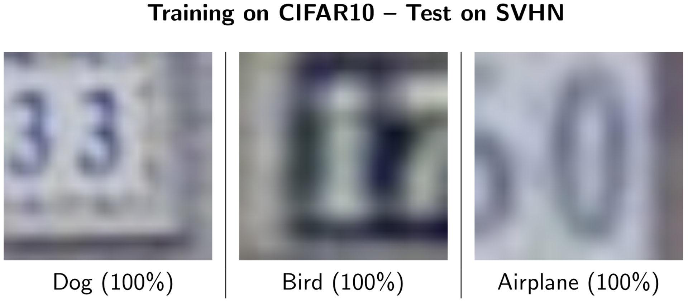</p>

We can clearly see this on the two moons dataset: the classifier outputs 100% confidence
almost everywhere, no matter how far away the points are from the training data.
<p align="center">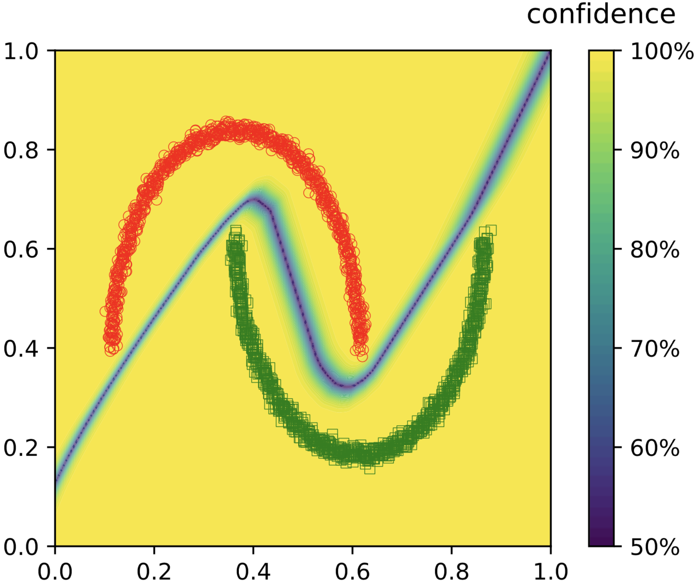</p>


### Theoretical argument
We give a theoretical argument of why ReLU activation function can lead to models with overconfident 
predictions far away from the training data. We leverage the fact that a ReLU network partitions the input space on
the finite set of polytopes.
<p align="center">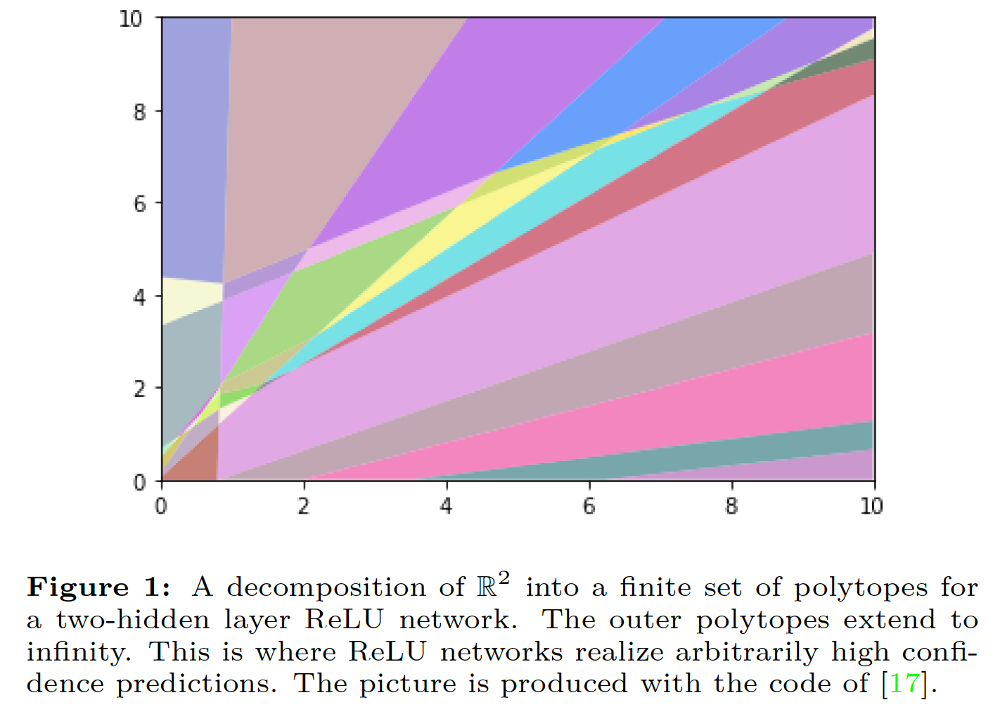</p>

The intuition is made formal in the main theorem.
<p align="center">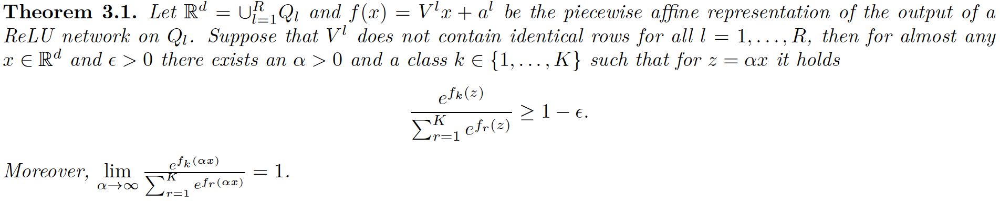</p>

### New training methods to mitigate the problem
In order to mitigate this problem, we propose a training scheme **CEDA** that enforces uniform confidences on 
out-of-distribution noise shown below.
<p align="center">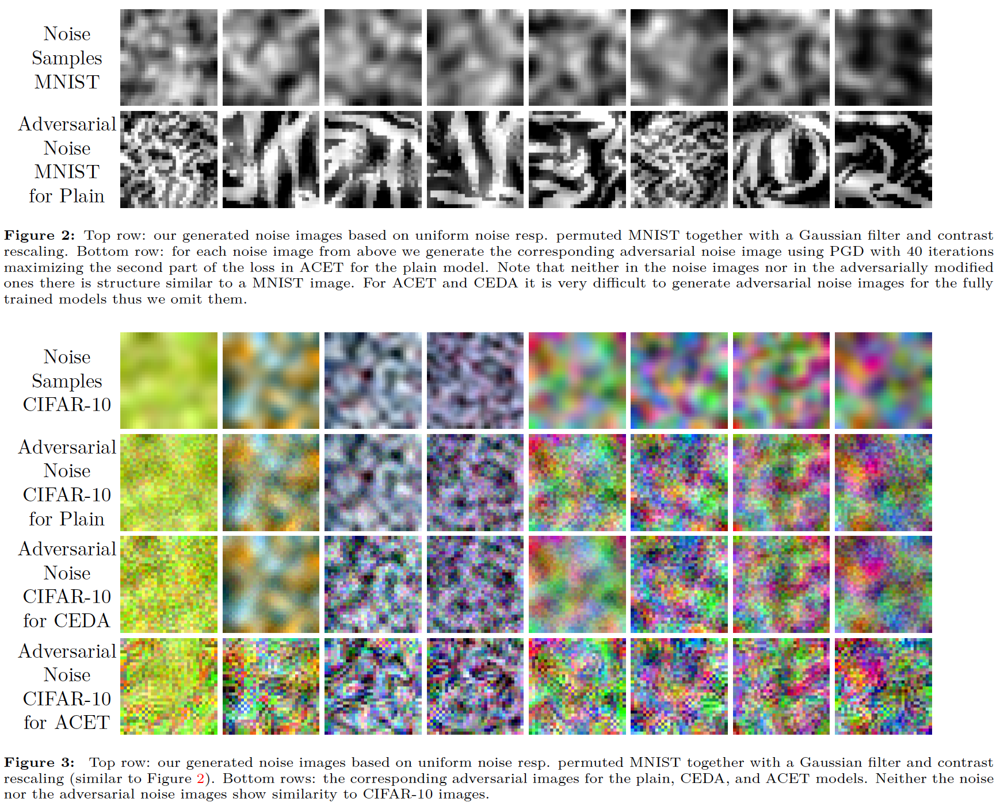</p>

We can see that CEDA already improves on the problem by preventing overconfident predictions.
<p align="center">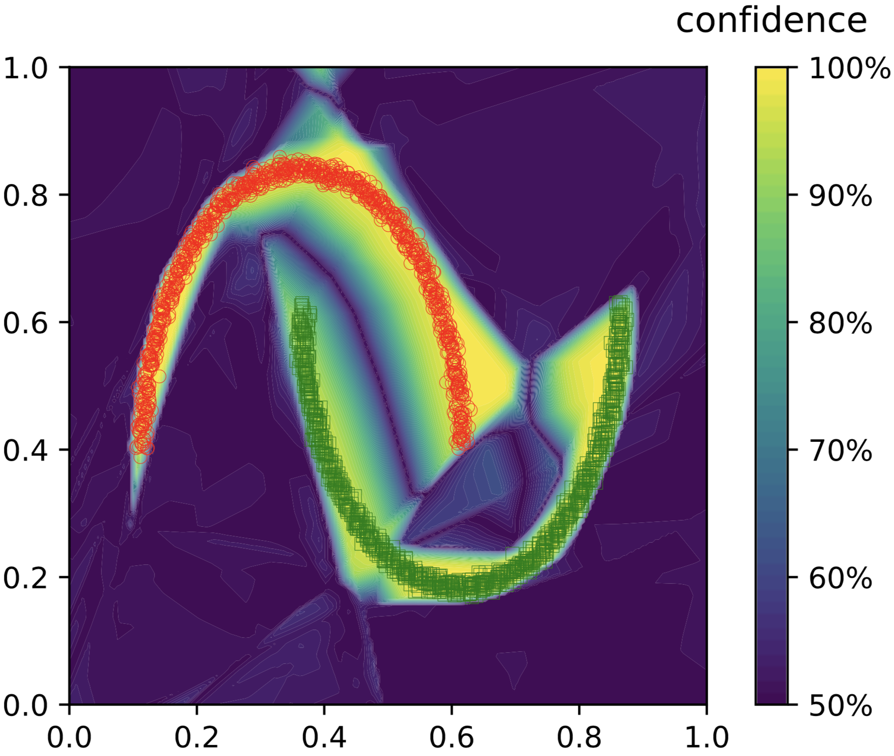</p>

Next we propose a robust optimization training scheme **ACET** which minimizes the worst-case noise in 
a neighbourhood of noise points. This works even better.
<p align="center">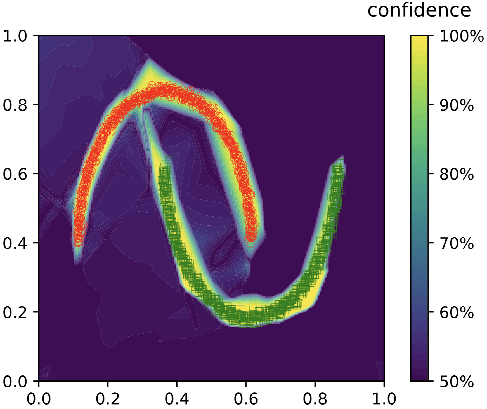</p>

Although, as predicted by Theorem 1, overconfident predictions still exist since this is an inherent property
of ReLU-networks regardless of the training procedure. If we zoom out from [0, 1] to [-10, 10], we can clearly see
that overconfident predictions are still there.
<p align="center">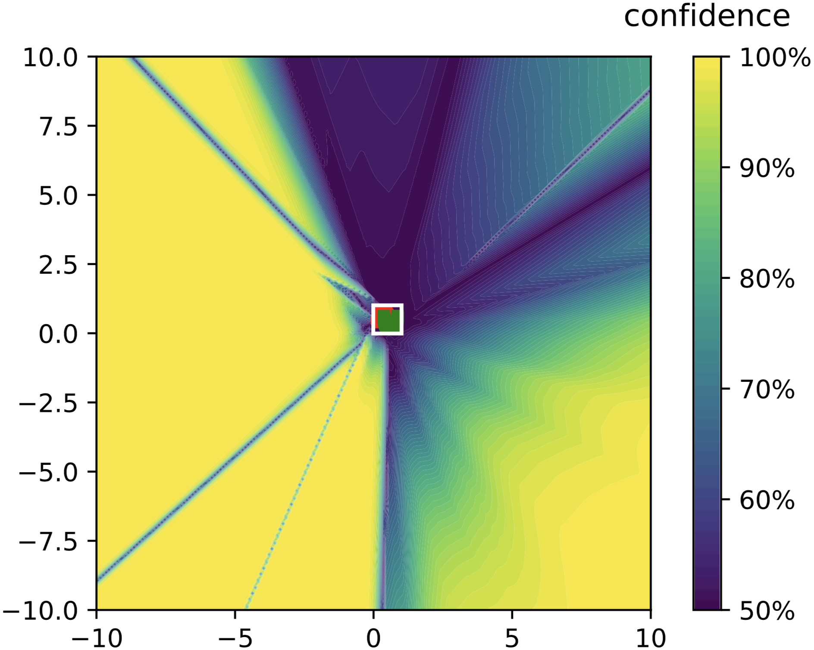</p>

We provide a systematic comparison of **ACET** over plain and **CEDA** models on various benchmarks: from evaluation on
noise to out-of-distribution detection on other image datasets.
<p align="center">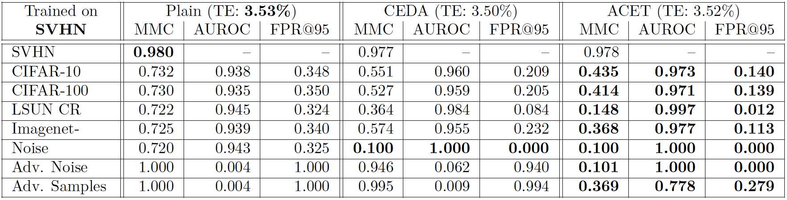</p>
<p align="center">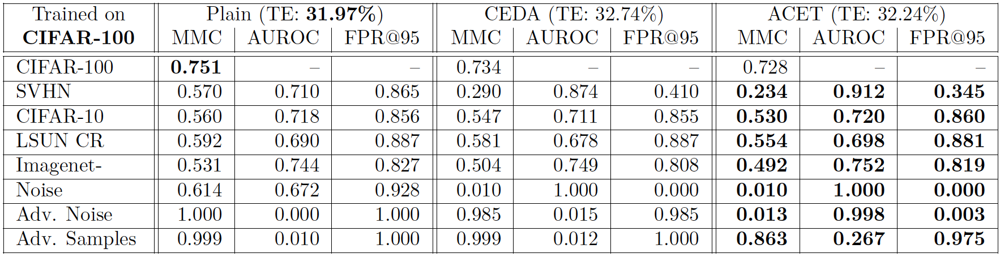</p>

We also illustrate the advantage of **ACET** on per-image basis. For example, if we train a plain model on MNIST and evaluate
it on CIFAR-10, it is prone to overconfident predictions (up to 99.6%) on images that do not have anything in common 
with digits.
<p align="center">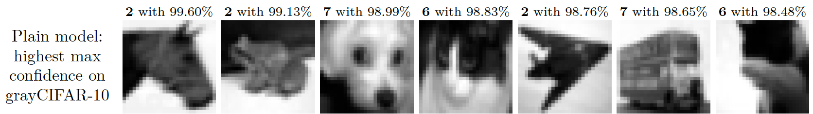</p>
However, **ACET** mitigates this problem to a large extent.
<p align="center">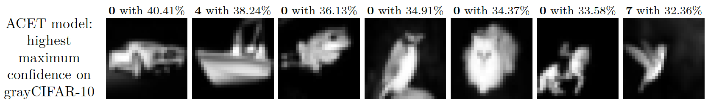</p>

### Experimental confirmation of Theorem 3.1
Finally, we illustrate Theorem 3.1 experimentally. We observe that simple alpha-scaling (i.e. brightness
increase) of, e.g., uniform noise can easily lead to overconfident predictions for plain models 
even in the image domain [0, 1]^d. At the same time, **ACET** models helps to mitigate this problem as well.
<p align="center">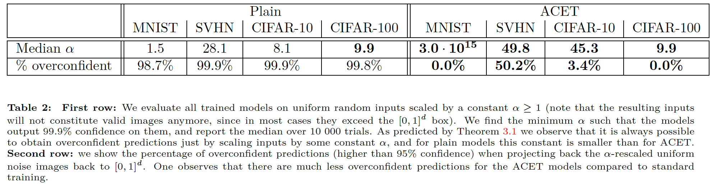</p>


## Code for training ACET models
`toy2d.ipynb` is a very short notebook that shows how to train an ACET model on two moons dataset. 
For full-fledged code on how to train CNNs with ACET on multiple GPUs with tensorboard summaries, 
please take a look onto `train.py`.


## Training details

Models are created and trained by using the `train.py` script. Get the list of possible arguments via `python3 train.py --help`. 

The value of  `at_frac` determines the number of noise examples (on which the maximal confidence should be small) per clean training example. Thus, if `--at_frac=0`, a **plain** model will be trained.
For the **CEDA** and **ACET** models we report in the paper, we set `--at_frac=1`, which means 50% clean and 50% (adversarial) noise images.

The value `pgd_niter` determines how many steps of pgd will be applied to the noise. If its value is zero, the first random step will not be applied and just the noise will be used -- this is the correct setting for **CEDA** training.

For **ACET**, the parameters `at_frac`, `pgd_niter` and `pgd_eps` should be positive. In the paper, we used `pgd_niter=40` and `pgd_eps=0.3`. While for plain and **CEDA** training the value of `pgd_eps` is not used, you can set it to compare their TensorBoard evaluations. As an example, for training the **ACET** model on SVHN we used the following command: 

`python3 train.py --exp_name='acet_svhn' --gpus=0 --n_epochs=100 --dataset=svhn --model=resnet_small --loss='max_conf' --opt=momentum --lr=0.1 --lmbd=0.0005 --pgd_eps=0.3 --at_frac=1 --pgd_niter=40`


## Pre-trained models from the paper
You can find all the models presented in Table 1 in the folder `exps_paper`. 
The file names of the models contain the hyperparameters used for their training. For example:
`2019-04-04 16:27:49_dataset=cifar100 model=resnet_small p_norm=inf lmbd=0.0005 at_frac=1.0 pgd_eps=0.3 pgd_niter=40 frac_perm=0.5 loss=max_conf`

means that the model was trained on CIFAR-100, the architecture was `resnet_small` (see `models.ResNetSmall` 
for its definition), **ACET** was applied on 50% examples in every batch (`at_frac=1.0`) wrt the Linf-norm `eps=0.3`, where 
the 40 steps of PGD were used in the robust optimization procedure. The loss function used in PGD was the maximum 
log probability taken over all classes.`frac_perm=0.5` means that the noise is generated
with 50% uniform and 50% permutation noise. 


## Evaluation

Evaluation is split into two parts: Collecting the model outputs on several datasets, including adversarial noise and adversarial samples, and analyzing the output numbers. 

First, run `evaluation.py` with the chosen hyperparameter settings for the evaluation as well as the model folder and name as arguments. This will save the predictions in numpy files within the model folder. For calculating the resulting statistics and plotting histograms and ROC curves, call `analysis.py` on that same folder. The resulting numbers are appended to a specified `.csv` file in the main folder, while you can find the plots as `.png` files within the model folder.

`python3 evaluation.py --model_folder "{model_folder}" --model_name "{model_name}" --model "{model_type}" --dataset "{model_set} --gpus=1 --at_frac=1 --pgd_niter=80 --pgd_eps "{eps}" --pgd_step "{step}" --loss='max_conf'`

`python3 analysis.py --model_folder "{model_folder}" --save_all_evals='results.csv'`

## TensorBoard

During training, several metrics are recorded as TensorBoard logs, which can be reviewed with `tensorboard --logdir=exps`.


## Requirements

Our code runs on `Python3.5`. For the computations we use `tensorflow:1.10.1` and dataloading is running with PyTorch version `0.4.1` and `torchvision`.

With Python3.5 installed, you can create a docker container that has all necessary dependencies installed by using the provided Dockerfile.


## Contact
Please contact [Maksym Andriushchenko](https://github.com/max-andr) or [Julian Bitterwolf](https://github.com/j-cb) 
regarding this code.


## Citation
```
@article{hein2019relu,
  title={Why ReLU networks yield high-confidence predictions far away from the training data and how to mitigate the problem},
  author={Hein, Matthias and Andriushchenko, Maksym and Bitterwolf, Julian},
  conference={CVPR 2019},
  year={2019}
}
```
